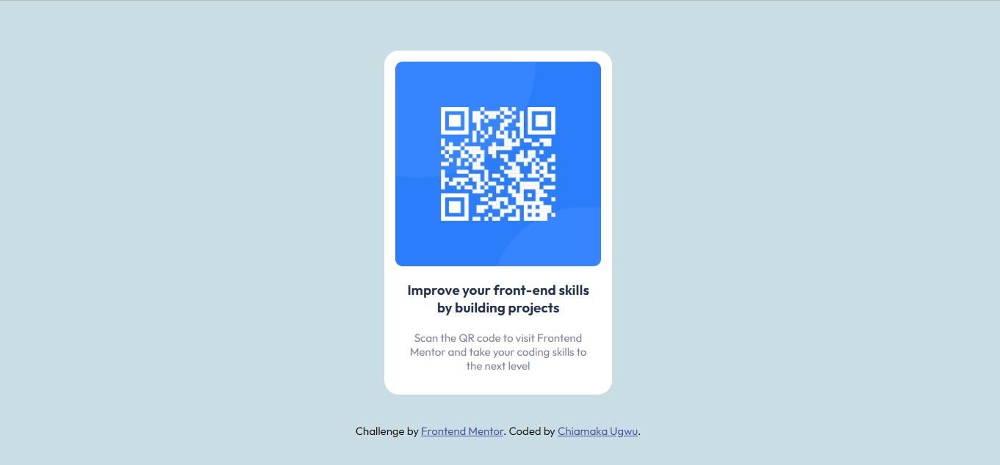

# Frontend Mentor - QR code component solution

This is a solution to the [QR code component challenge on Frontend Mentor](https://www.frontendmentor.io/challenges/qr-code-component-iux_sIO_H). Frontend Mentor challenges help you improve your coding skills by building realistic projects. 

## Overview

### Screenshot

### Links

- Solution URL: [Add solution URL here](https://your-solution-url.com)
- Live Site URL: [Add live site URL here](https://your-live-site-url.com)

### Built with

- Semantic HTML5 markup
- CSS custom properties

### What I learned

I was able to put into paractice the use of the display:flex property which I have come accross in so many online tutorials. I have finally
gotten a hang of it!

### Continued development

I certainly need to focus more on responsiveness. I was able to make it somewhat responsive but I know that with more pratice, I can do better.

## Author

- Frontend Mentor - [@chiamaka-ugwu](https://www.frontendmentor.io/profile/chiamaka-ugwu)
- Twitter - [@chiamakaugwu_](https://www.twitter.com/chiamakaugwu_)
